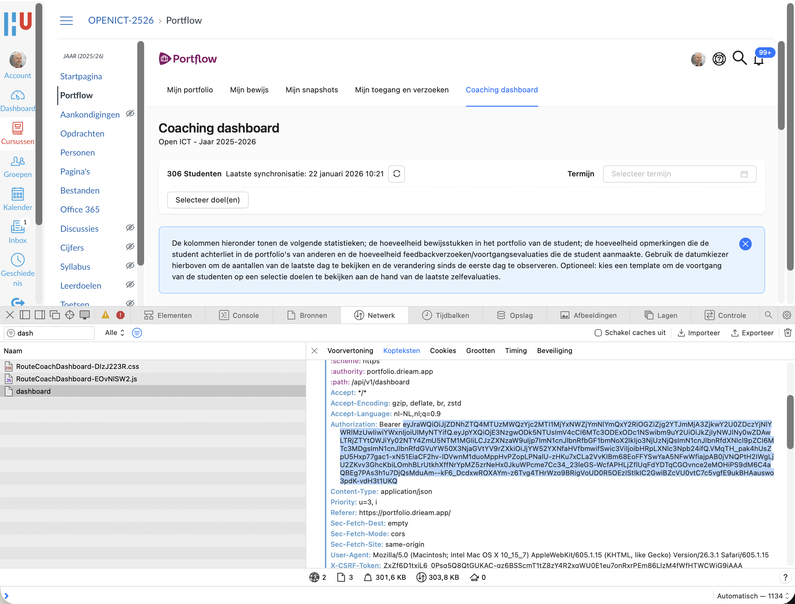

# portflow-api-python

Generate student evaluation overviews from the Portflow API.

This repository currently contains one main script:

- `portflow.py`
- `portflow_export_full.py`

It can show:

- A single student overview in the terminal
- A CSV export for all selected students
- A compact table for selected students
- A full student portfolio export to folders (evaluations + skills + evidence)

## Requirements

- Python 3.10+
- `requests` package

Install dependency:

```bash
pip install requests
```

## Configuration

Main settings are at the top of `portflow.py`:

- `BASE_URL`
- `SECTION_ID`
- `CURRENT_SEMESTER_START`
- `CURRENT_SEMESTER_END`
- `CURRENT_COACH_STUDENTS`
- `BEARER_TOKEN`

Notes:

- If `BEARER_TOKEN` is empty, the script prompts for one.
- `CURRENT_COACH_STUDENTS` is the default student subset.
- If `CURRENT_COACH_STUDENTS` is empty, the script automatically falls back to all visible shared portfolios.

## Run

Default run:

```bash
python3 portflow.py
```

Show all students you can see (not only `CURRENT_COACH_STUDENTS`):

```bash
python3 portflow.py --all
```

Equivalent explicit mode:

```bash
python3 portflow.py --students all
```

Full collection export for one selected student:

```bash
python3 portflow_export_full.py
```

Optional arguments:

```bash
python3 portflow_export_full.py --students-source section --section-id 72086 --output-dir ./exports
```

Or fetch students from shared collections:

```bash
python3 portflow_export_full.py --students-source shared
```

## CLI Options

- `--all`
	- Shortcut for `--students all`
- `--students {coach,all}`
	- `coach` (default): filter to `CURRENT_COACH_STUDENTS`
	- `all`: use all students with shared portfolios
- `--dump-schema`
	- Write observed API schema paths/types to `schema_inventory.txt`
- `--debug-api`
	- Log all API calls and raw response bodies to `api_debug_log.jsonl`
- `--debug-pending`
	- Log evaluation include/skip decisions to `pending_debug.json`

## Runtime Flow

On start, the script:

1. Prints current semester range from `CURRENT_SEMESTER_START` and `CURRENT_SEMESTER_END`
2. Fetches students (coach subset by default, or all with `--all`)
3. Shows students list
4. Asks output method:
	 - `1` Single student
	 - `2` All students (export CSV)
	 - `3` Students in table
5. Shows output once and exits

## Capture bearer token

To be able to use the python script, you'll need to capture a bearer token.

1. Log in to [portflow](https://canvas.hu.nl/courses/51659/external_tools/1134), using HU account
2. Open "inspector" in browser
3. Open "network" tab
4. Filter on "dashboard"
5. Reload (F5) the page
6. <copy><paste> the bearer token

Screenshot shows how to capture a bearer token using Safari browser and "inspector" (the bearer token in the screenshot is invalid)


## Output Behavior

### Full export (`portflow_export_full.py`)

Flow:

1. Script vraagt om een student te kiezen.
2. Script maakt een nieuwe map met `studentnaam + datum`.
3. Script exporteert per evaluatie map:
	 - bewijsstukken (bijlagen)
	- bewijsstukken die als `@evidence` mention in evaluatietekst staan
	- per `@evidence` mention een submap met het gelinkte bestand en alle verwijzende opmerkingen/zelfevaluaties/beoordelingen
	 - opmerkingen (feedback/comments)
	 - zelfevaluaties
	 - beoordelingen (incl. beoordelaar, datum en niveau waar beschikbaar)
4. Script maakt daarnaast 10 vaardigheidsmappen met een `overzicht.txt` per vaardigheid.
5. Script maakt in de root een samenvattend `overzicht.txt` met alle gevonden items.
6. Script maakt in de root een `index.csv` met per item: evaluatie-map, vaardigheid, code, auteur, datum, type, niveau en aantal bijlagen.

Globale structuur:

```text
/Student Naam dd-mm-yyyy/
	overzicht.txt
	index.csv
	/evaluatie dd-mm-yyyy titel-van-de-evaluatie/
		bewijsstuk 1.pdf
		opmerking 1 - auteur - dd-mm-yyyy.txt
		zelfevaluatie - auteur - dd-mm-yyyy.txt
		beoordeling - auteur - dd-mm-yyyy - niveau.txt
	/vaardigheid 1 OC Overzicht creeren/
		overzicht.txt
	...
	/vaardigheid 10 RE Reflecteren/
		overzicht.txt
```

### Single student (`1`)

- Shows per-goal evaluations in terminal.
- Includes self-evaluations.
- Self-evaluations are shown as:
	- `? (self, <date>)`

### CSV export (`2`)

- Writes `results.csv`.
- Uses selected student set (coach subset or all).

### Table (`3`)

- Prints compact table with goal abbreviations (`OC`, `KO`, etc.).
- Self-evaluations are rendered as `?`.

Example (anonymized):

```text
Naam         | OC      | KO      | JKO     | KPM     | PL      | BD      | SW      | FO      | PH      | RE
------------------------------------------------------------------------------------------------------------------
Student 01   |         |         |         |         |         |         |         | 1       | 1       | 1
Student 02   | 3       | 3       | 2       | 2       | 2       | 2       | 2       | ?       | 2       | 3
Student 03   |         |         |         |         |         | 2       | 1       |         | ?, 1    | 2
Student 04   |         |         | 2       |         | ?       | 2, 2    | 2       | 2       | 2       |
Student 05   |         |         |         |         | ?       | ?       | ?       |         | ?       | ?
Student 06   | 1       | 1       | 1, 1    | 1       | 1       | 2       | 2       | 2       | 1       | 1
Student 07   | ?, ?    | ?, ?    | ?, ?    | ?, ?    | ?, ?    | ?, 1, ? | 1, 1    | ?       | ?, ?, ? | 1
Student 08   |         |         | 3       |         | 2       | 3, 3    | 2       | ?       | ?       | 2
Student 09   | ?       | ?       | ?       |         |         | 1       | ?       | ?       | 2       |
Student 10   | ?, ?    | ?, ?    | ?, ?    | ?, ?    | 2       | 2       | 2, ?    | 2       | 2       | 1
Student 11   | 1       | 1       | 1       | 2       | ?       | 2       | ?       | ?       | ?       | ?
Student 12   | 2, ?    | 2, ?    | 2, ?    | 2, ?    | ?       | 2       | ?       | ?, 1    | 1       | 2
Student 13   | 1       | ?       |         |         | 2       | 1       | 2       |         | 1       |
Student 14   |         |         |         |         |         |         | 1       |         |         |
Student 15   |         |         |         |         |         |         |         |         |         |
Student 16   | 1       | 1       | 1       | 1, ?    | 1       | 2       | 2       |         | 2       | ?
Student 17   | ?       | ?       | ?       | ?       | ?, ?    | ?       | ?, ?    | ?, ?    | ?, ?    | ?
Student 18   | ?       | ?       | ?       | ?       | 2       | 2       | 2       | 2       | 2       |
```

### Self vs non-self precedence

For the same evaluation request/group:

- If a non-self evaluation exists (`coach`, `assessor`, etc.), only non-self is shown.
- Self-evaluation is shown only when no non-self evaluation exists for that same request/group.

## Debug Artifacts

When enabled:

- `--debug-api` -> `api_debug_log.jsonl`
	- One JSON object per request
	- Includes URL, params, status code, error, response body
- `--debug-pending` -> `pending_debug.json`
	- Include/skip decisions and rendered values per evaluation

## Security

- Do not commit live bearer tokens to version control.
- Prefer environment variables or prompt input for tokens in shared repos.
